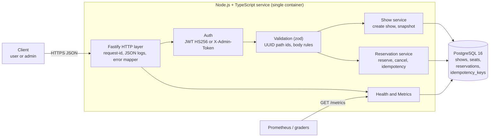
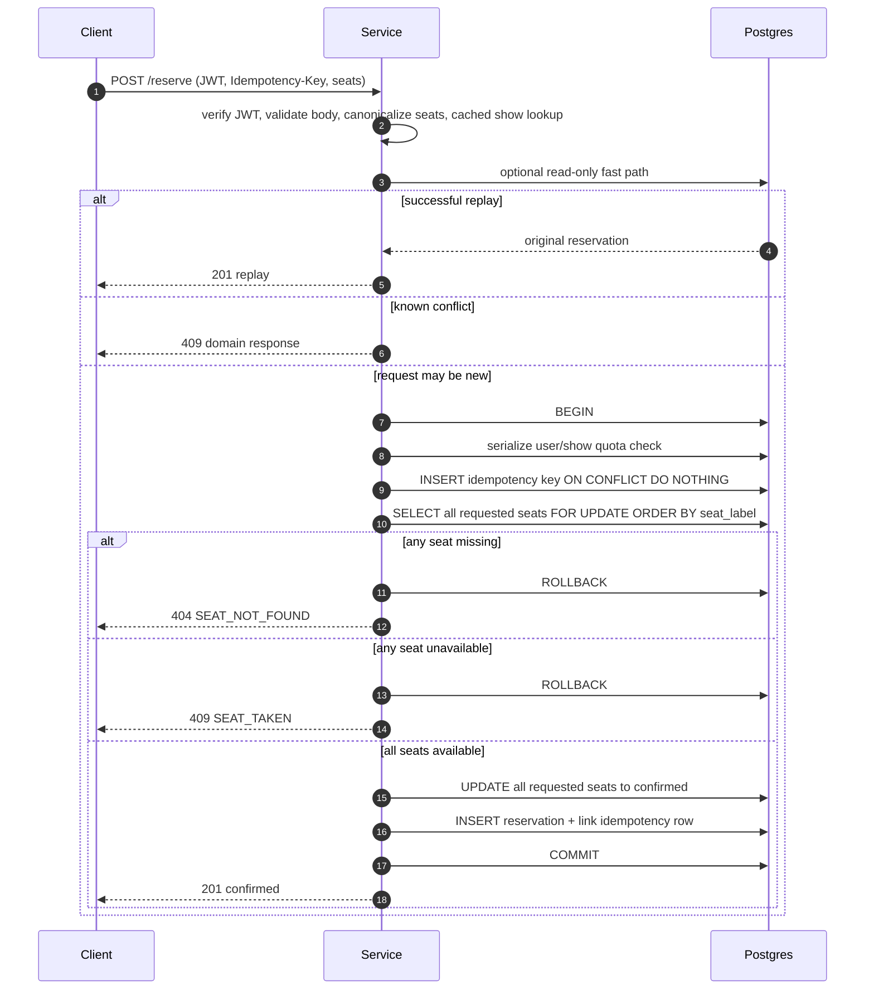
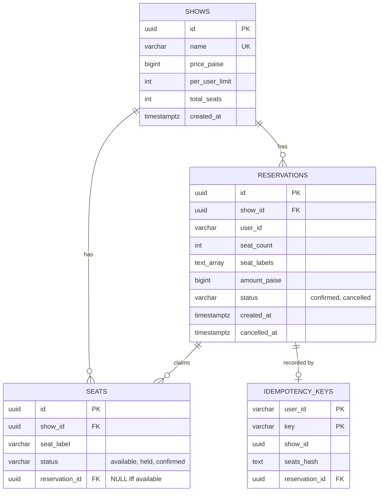
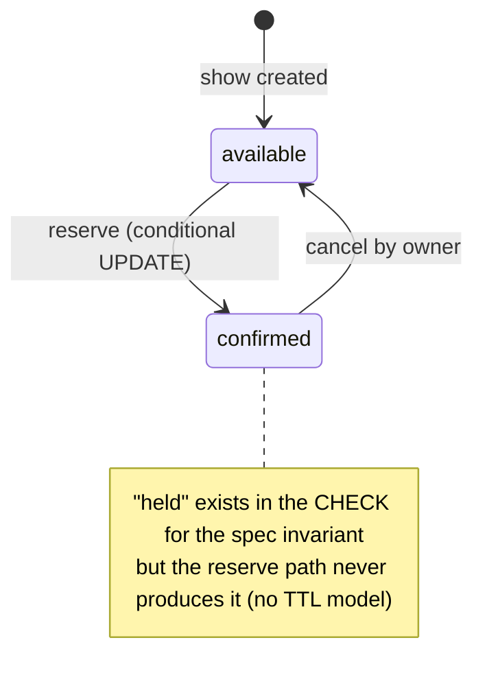
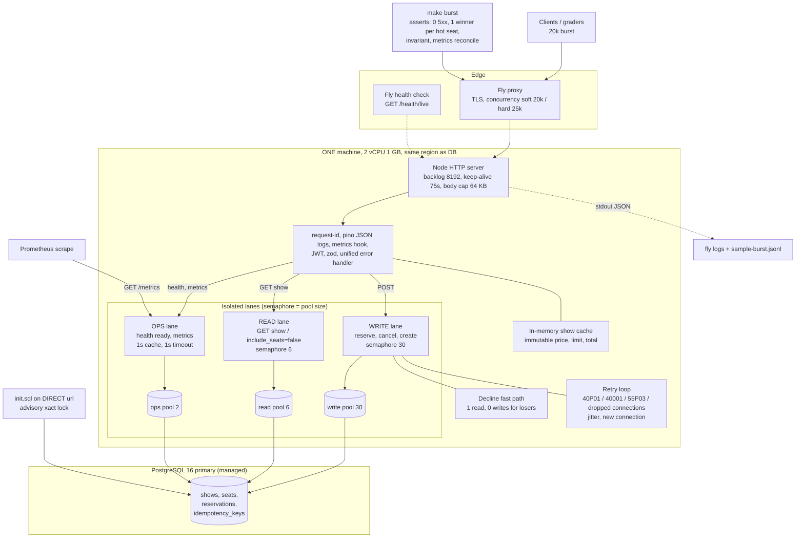
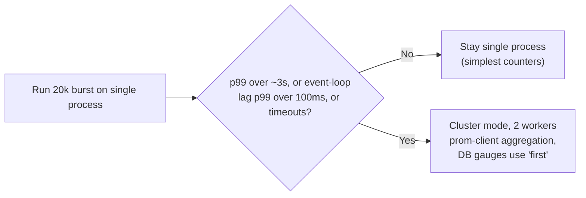
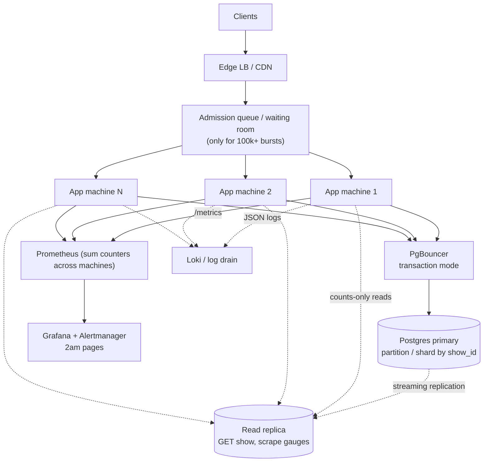

# Complete Task Breakdown: Seat Reservation at Scale


This document breaks the task into requirements, APIs, architecture, data model, scaling, trade-offs, and reasoning. The design reflects IMPLEMENTATION Plan v4 (Node.js + TypeScript on PostgreSQL). Requirement IDs (F1, N1, ...) are used for traceability in §13.

> **One line summary:** build a seat-selling JSON API where the *atomic decision* lives in Postgres, then deploy it and prove with metrics, logs, and a burst script that it never double-sells, handles normal contention as 4xx domain outcomes, and always reconciles.

---

## 1. What Is Being Asked

A show goes on sale at t=0 with N numbered seats. Tens of thousands of buyers hit "book" within one second, many fighting for the same hot seats (500 users on seat A12). The service is the **system of record** that decides, atomically, who gets each seat.

**How it is graded:** the *running service*, not the write-up. Graders clone it, check it deploys, then hit the live URL with their own \~20,000-request concurrency burst. Deploy & Observe is weighted equally with correctness.

---

## 2. Requirements

### 2.1 Functional requirements

| ID Requirement Acceptance  |                                                                                                                         |                                                                                     |
| -------------------------- | ----------------------------------------------------------------------------------------------------------------------- | ----------------------------------------------------------------------------------- |
| **F1**                     | **Create show**: `POST /shows` (admin) with `{name, seats[], price_paise}`                                              | 201 with id and every seat `available`                                              |
| **F2**                     | **Reserve seat(s)**: `POST /shows/{id}/reserve` (user). Identity from token. Seats and idempotency key (header or body) | 201 `{reservation_id, show_id, user_id, seats, amount_paise, status:"confirmed"}`   |
| **F2a**                    | **No double-sell**: a seat confirmed/held for one user can never be confirmed for another                               | 1 winner per seat; losers 409, never 500                                            |
| **F2b**                    | **Per-user limit** (default 4 per show)                                                                                 | Over-limit is a clean 409 decline                                                   |
| **F2c**                    | **Idempotency**: same key reserves once; retry returns original; same key + different seats → 409                       | Exactly-once                                                                        |
| **F2d**                    | **Partial requests**: define and document behaviour (all-or-nothing vs best-effort), must hold under concurrency        | We choose all-or-nothing                                                            |
| **F3**                     | **Release**: `POST /reservations/{id}/cancel` (owner only) **or** time-boxed hold with expiry                           | Seat becomes re-bookable; release never resurrects a seat confirmed to someone else |
| **F4**                     | **Show state**: `GET /shows/{id}` returns per-seat status and counts                                                    | `available + held + confirmed == total_seats` always                                |
| **F5**                     | **Health and metrics** endpoints                                                                                        | See N5 to N7                                                                        |
| **F6**                     | **Money** is integer paise, never float                                                                                 | Validation rejects floats                                                           |

### 2.2 Non-functional requirements

| ID Requirement Target  |                                                                                                                                                                                                              |                                    |
| ---------------------- | ------------------------------------------------------------------------------------------------------------------------------------------------------------------------------------------------------------ | ---------------------------------- |
| **N1**                 | **Correctness under concurrency**: no seat confirmed twice, per-user limit and idempotency hold under parallel requests                                                                                      | Hot seat: exactly one 201          |
| **N2**                 | **Zero 5xx under healthy infrastructure** across a \~20k-request burst. Declines are 4xx domain outcomes                                                                                                                                  | 0 server errors, 0 client timeouts |
| **N3**                 | **Invariant**: `available + held + confirmed == total_seats` during and after load                                                                                                                           | Exact to the unit                  |
| **N4**                 | **Security**: identity is token-derived; spoofed body fields ignored; only the owner cancels                                                                                                                 | Tests assert it                    |
| **N5**                 | **Liveness and readiness**: readiness checks the DB and fails closed                                                                                                                                         | 503 when DB is down                |
| **N6**                 | **Metrics**: Prometheus. Minimum: confirmed counter, declined-by-reason counter (seat-taken / per-user-limit / idempotent-replay), seats-available gauge. **Must reconcile** with API and observed behaviour | Reconciliation rules in §10        |
| **N7**                 | **Logs**: structured, with correlation/request id; public access or screen recording                                                                                                                         | JSON lines                         |
| **N8**                 | **Availability / cold start**: public URL survives cold start and comes up healthy                                                                                                                           | No crash when DB is asleep         |
| **N9**                 | **Reproducibility**: containerised; clean checkout builds and runs the same as the deploy                                                                                                                    | `docker compose up`, `fly deploy`  |
| **N10**                | **Operability**: one-command burst script reproduces the stampede against the live URL and prints outcome distribution and reconciliation                                                                    | `make burst`                       |
| **N11**                | **Latency and throughput** (self-imposed, not in the task): p99 under about 3s at 20k burst, so graders' client timeouts never look like failures                                                            | Measure and decide (§9)            |
| **N12**                | **Maintainability / process**: incremental commit history, honest AI disclosure, depth that survives a live extension interview                                                                              | `AI_LOG.md`, WRITEUP               |

### 2.3 Deliverables

1. Public Git repo with full, incremental commit history.
2. Live URL.
3. One-command burst script plus README instructions.
4. Metrics and logs access.
5. `WRITEUP.md`: atomic decision, idempotency, holds and expiry, consistency vs availability under partition, observability (2am paging), AI usage, next steps.

### 2.4 Ground rules

Money in integer paise. AI allowed and expected, disclose usage. A clean checkout must build and run. A deploy that is down is the most common way strong submissions fail.

---

## 3. Design Decisions at a Glance

| Question Decision Why (short)        |                                                                                               |                                                                     |
| ------------------------------------ | --------------------------------------------------------------------------------------------- | ------------------------------------------------------------------- |
| Where does the atomic decision live? | In Postgres: one transaction with deterministic `SELECT ... FOR UPDATE` on requested seats, then an atomic update | Single atomic step; no read-then-write window                       |
| Partial requests                     | **All-or-nothing**                                                                            | Simple, atomic, easy to document                                    |
| Release model                        | **Explicit cancel**; reserve = `confirmed` immediately; no TTL                                | Matches the 201 `status:"confirmed"` contract                       |
| Idempotency storage                  | Separate table, PK `(user_id, key)`, retained for the lifetime of the reservation/show                                                  | Per-user isolation; no key-reuse window or cleanup job                  |
| Stack                                | Node 22, TypeScript, Fastify, `pg`, zod, pino, prom-client                                    | Event-loop I/O suits many short DB calls                            |
| Database                             | PostgreSQL 16                                                                                 | Row locks, constraints, advisory locks where needed, transactional integrity |
| Workers                              | 1 process, 1 machine for the graded burst; cluster only if measured need                      | Simple, correct counters                                            |

---

## 4. API

| Method Path Auth Purpose  |                             |                 |                                                                            |
| ------------------------- | --------------------------- | --------------- | -------------------------------------------------------------------------- |
| POST                      | `/auth/token`               | dev flag        | Mint a JWT for `{user_id}`. **Grader convenience, disabled in production** |
| POST                      | `/shows`                    | `X-Admin-Token` | Create show                                                                |
| GET                       | `/shows/{id}`               | public          | Per-seat state and counts. `?include_seats=false` returns counts only      |
| POST                      | `/shows/{id}/reserve`       | User JWT        | Reserve seats (all-or-nothing)                                             |
| POST                      | `/reservations/{id}/cancel` | Owner JWT       | Release seats                                                              |
| GET                       | `/health/live`              | public          | Always 200, no DB                                                          |
| GET                       | `/health/ready`             | public          | DB check, 503 when down                                                    |
| GET                       | `/metrics`                  | public          | Prometheus text                                                            |

### 4.1 Examples

**Create show**

```http
POST /shows
X-Admin-Token: <admin>
{ "name": "friday-night", "seats": ["A1","A2","A12"], "price_paise": 25000 }

```

```json
201 { "id": "…", "name": "friday-night", "price_paise": 25000, "per_user_limit": 4,
      "total_seats": 3, "available": 3, "held": 0, "confirmed": 0,
      "seats": [ {"label":"A1","status":"available"}, {"label":"A2","status":"available"}, {"label":"A12","status":"available"} ] }

```

**Reserve**

```http
POST /shows/{id}/reserve
Authorization: Bearer <jwt>
Idempotency-Key: k1
{ "seats": ["A12"] }

```

```json
201 { "reservation_id": "…", "show_id": "…", "user_id": "alice",
      "seats": ["A12"], "amount_paise": 25000, "status": "confirmed" }

```

**Cancel**: `POST /reservations/{id}/cancel` → `200 { …, "status": "cancelled" }`

### 4.2 Error format (every response, including validation and unhandled)

```json
{ "error": "Conflict", "message": "Seat A12 is already taken", "code": "SEAT_TAKEN" }

```

| Code HTTP Meaning      |     |                                                                             |
| ---------------------- | --- | --------------------------------------------------------------------------- |
| `SEAT_TAKEN`           | 409 | A requested seat is confirmed (or stayed contended after retries)           |
| `USER_LIMIT_EXCEEDED`  | 409 | Would exceed `per_user_limit`                                               |
| `IDEMPOTENCY_CONFLICT` | 409 | Same key, different seats/show                                              |
| `SHOW_EXISTS`          | 409 | Duplicate show name                                                         |
| `SEAT_NOT_FOUND`       | 404 | Label not in the show                                                       |
| `NOT_FOUND`            | 404 | Unknown show/reservation, malformed id, unknown route                       |
| `INVALID_BODY`         | 400 | Validation failure                                                          |
| `UNAUTHORIZED`         | 401 | Missing/invalid token                                                       |
| `FORBIDDEN`            | 403 | Cancelling someone else's reservation                                       |
| `TRY_AGAIN`            | 503 | Last resort after DB retries are exhausted (should never appear in a burst) |

### 4.3 Behaviour rules

- Identity comes **only** from the JWT (`sub`, fallback `user_id`). Body fields like `user_id` are never read.
- Idempotency key from header `Idempotency-Key` or body `idempotency_key`; header wins; both present and different → 400.
- A **replay returns 201** with the original reservation (and shows `cancelled` if it was later cancelled).
- **Declines are not cached**: the same key may be retried after a 409.
- Repeat cancel is a 200 no-op.

---

## 5. Architecture Diagram 1: Fulfils the Functional Requirements

The smallest design that satisfies F1 to F6 and the correctness bar: one stateless service, one Postgres that holds all truth.



### 5.1 How the reserve flow guarantees correctness



**Why this is race-free:** the authoritative decision is made while PostgreSQL holds row locks on every requested seat in deterministic order. A concurrent request for the same seat waits for the first transaction to commit or roll back, then observes the committed state. There is no read-then-write window in the sale path, and a multi-seat request either claims every requested seat or none.

The optional fast path is only an optimisation. It may return an early domain decline when it observes a confirmed seat, but it never grants ownership. The transaction remains the only authority for a new reservation.

---

## 6. Data Model

### 6.1 Entities



### 6.2 Constraints that carry the invariants

| Constraint Protects                                       |                                                                          |
| --------------------------------------------------------- | ------------------------------------------------------------------------ |
| `UNIQUE (show_id, seat_label)`                            | A seat exists once per show                                              |
| `CHECK ((status='available') = (reservation_id IS NULL))` | A seat is owned iff it is not available                                  |
| `CHECK status IN (...)` on seats and reservations         | Only legal states                                                        |
| `reservation_id` FK                                           | Reservation ownership is valid only for an existing reservation row          |
| `PRIMARY KEY (user_id, key)` on idempotency               | Same key maps to one reservation for the exercise lifetime; no cross-user replay                      |
| `BIGINT` money, `price_paise ≤ 1e12`                      | Integer paise, no overflow, safe as a JS number                          |
| `CHECK (seat_count = cardinality(seat_labels))`              | Stored count always matches stored seat labels                          |
| `seat_labels TEXT[]` on reservations                      | Replay of a cancelled reservation still returns the original seats       |

### 6.3 Seat state machine



---

## 7. Database

| Topic Choice  |                                                                                                                                                                |
| ------------- | -------------------------------------------------------------------------------------------------------------------------------------------------------------- |
| Engine        | **PostgreSQL 16** (managed: Fly Postgres / Neon / Render)                                                                                                      |
| Why           | Row-level locks, CHECK/UNIQUE constraints, optional advisory transaction locks, transactional DDL, `unnest` bulk insert                                   |
| Consistency   | Single primary, so strongly consistent. We choose **CP**: readiness fails closed and there is one writer, so no split-brain                                    |
| Connections   | `DATABASE_URL` (app, may be pooled) and `DATABASE_DIRECT_URL` (init/migrations only)                                                                           |
| Pooler safety | No named prepared statements, no session-level locks (only `pg_advisory_xact_lock`)                                                                            |
| Migrations    | Idempotent `init.sql`, one transaction, under an advisory lock, so concurrent boots are safe                                                                   |
| Indexes       | `(show_id, status)` for counts, partial `(user_id, show_id) WHERE confirmed` for limit checks, partial `(reservation_id)` for cancel |
| Region        | Same region as the app: each reserve makes several round trips                                                                                                 |

---

## 8. Non-Functional Hardening Summary

| NFR Mechanism  |                                                                                                                                                                                                 |
| -------------- | ----------------------------------------------------------------------------------------------------------------------------------------------------------------------------------------------- |
| N1             | Deterministic row locks + atomic transaction, advisory lock per (user, show), idempotency PK                                                                                                                |
| N2             | 4xx for every domain outcome; retries for deadlock, serialization, lock timeout **and dropped connections**; unified error handler; proxy limits raised; in-memory queue instead of 503 limiter |
| N3             | CHECK constraints + atomic transitions; counts from a single snapshot                                                                                                                           |
| N4             | Identity from JWT only, pinned HS256, owner check on cancel                                                                                                                                     |
| N5 to N7       | Separate ops pool, liveness without DB, DB-derived gauges, JSON logs with request id                                                                                                            |
| N8             | Startup connect-with-backoff, `min_machines_running=1`, no auto-stop                                                                                                                            |
| N9             | Dockerfile (non-root), compose with DB healthcheck, pinned deps, `.env.example`                                                                                                                 |
| N10            | `make burst` with assertions and non-zero exit                                                                                                                                                  |
| N11            | Fast path, show cache, lanes, measured single-process performance                                                                                                                           |

---

## 9. Architecture Diagram 2: Scaled to Fulfil the Non-Functional Requirements

This builds on Diagram 1. The functional core is unchanged; we add **isolation lanes, a cheap-decline path, edge limits, health separation, and observability** so the 20k burst yields zero application/proxy 5xx under healthy infrastructure.



### 9.1 What each addition buys

| Addition Requirement served Effect               |            |                                                                                   |
| ------------------------------------------------ | ---------- | --------------------------------------------------------------------------------- |
| Fly concurrency limits raised, VM sized          | N2         | The proxy does not shed load with its own 503                                     |
| Backlog, keep-alive, `ulimit -n`                 | N2         | Burst connections are accepted, not refused                                       |
| Semaphore = pool size, queue in memory           | N2, N11    | No pool-timeout errors; excess requests simply wait                               |
| **Separate read and ops lanes**                  | N2, N5, N6 | Graders' polling of `GET /shows` and `/health/ready` never queues behind reserves |
| **Decline fast path** (one read, no writes)      | N1, N11    | About 99% of hot-seat losers cost no dead tuples or WAL                           |
| Deferred FK (claim before reservation insert)    | N11        | Only winners write a reservation row                                              |
| Retry loop incl. connection errors               | N2         | Transient DB failures never surface as 500                                        |
| Show cache                                       | N11        | One less round trip per reserve                                                   |
| `include_seats=false`                            | N11        | A 50k-seat show polled with a tiny `GROUP BY`                                     |
| Liveness without DB, Fly check on `/health/live` | N5, N8     | A readiness blip cannot kill the machine mid-burst                                |
| Startup backoff, min 1 machine                   | N8         | Cold start with sleeping DB stays up                                              |
| Metrics rules + pre-initialised series           | N6         | `201 = confirmed_total + idempotent_replay`; zero shows as 0, not "missing"       |
| Blue/green deploy, 35s kill timeout, 30s drain   | N2         | Deploys do not drop in-flight requests                                            |

### 9.2 Throughput decision (measure, do not guess)



### 9.3 Architecture Diagram 3: Growth path beyond the take-home

Not needed for the graded burst, but this is where the design extends. Every step keeps Postgres as the single arbiter of seat ownership.



---

## 10. Observability Design

### 10.1 Metrics

| Metric Type Notes                                                                |                 |                                                                                                                        |
| -------------------------------------------------------------------------------- | --------------- | ---------------------------------------------------------------------------------------------------------------------- |
| `reservations_confirmed_total{show_id}`                                          | Counter         | **New** reservations only                                                                                              |
| `reservations_declined_total{show_id,reason}`                                    | Counter         | reason ∈ `seat_taken`, `per_user_limit`, `idempotent_replay`, `idempotency_conflict`, `seat_not_found`, `invalid_body` |
| `reservations_cancelled_total`, `seats_confirmed_total`, `seats_cancelled_total` | Counter         | Make the cancel relation checkable                                                                                     |
| `seats_available / held / confirmed{show_id}`                                    | Gauge           | **Computed from the DB at scrape time** (1s cache)                                                                     |
| `http_request_duration_seconds`                                                  | Histogram       | method, route template, status                                                                                         |
| `http_5xx_total{route}`                                                          | Counter         | Should stay 0                                                                                                          |
| `db_retries_total{reason}`, `reserve_queue_depth`, `db_pool_*`                   | Counter / Gauge | Saturation and near-miss signals                                                                                       |
| `nodejs_eventloop_lag_seconds`                                                   | Gauge           | Single-process ceiling indicator                                                                                       |

### 10.2 Reconciliation rules

- **`# of 201 responses = reservations_confirmed_total + reservations_declined_total{reason="idempotent_replay"}`** (replays also return 201).
- `seats_confirmed (gauge) = seats_confirmed_total − seats_cancelled_total` on a single machine since show creation.
- Seat gauges equal `GET /shows/{id}` because both come from the DB.
- Counters are per process and reset on restart. Sum across machines or workers.

### 10.3 Logs

JSON lines to stdout: `{ts, level, request_id, method, route, status, duration_ms, user_id, show_id, outcome}`. `X-Request-ID` is accepted or generated and echoed back. Fly logs are not public, so ship a screen recording of the burst plus a committed `sample-burst.jsonl`.

### 10.4 What pages you at 2am

Any 5xx, `/health/ready` failing, `reserve_queue_depth` growing, pool saturation, p99 latency, event-loop lag, invariant gauge drift, `TRY_AGAIN` or connection-retry counts above zero, infrastructure retry/DB health.

---

## 11. Trade-offs

| Decision Gain Cost / risk Mitigation              |                                                            |                                                                        |                                                                        |
| ------------------------------------------------- | ---------------------------------------------------------- | ---------------------------------------------------------------------- | ---------------------------------------------------------------------- |
| **All-or-nothing** multi-seat                     | Atomic, simple, easy to reason about                       | A user wanting 2 seats gets nothing if one is taken                    | Document it; best-effort is a future option                            |
| **Confirm on reserve, no TTL**                    | Matches the 201 contract; no expiry job; no resurrect race | No payment step; seats never auto-release                              | Cancel endpoint; TTL hold is a clear future extension                  |
| **Deterministic `FOR UPDATE` row locks**         | Simple, provable atomic ownership and all-or-nothing multi-seat booking | Contending transactions wait briefly on the same seat                 | Lock seats in deterministic order; keep transactions short             |
| **Separate lanes and pools**                      | Polling and health stay fast during the burst              | More connections (38 per machine)                                      | Document `max_connections` arithmetic                                  |
| **In-memory queue instead of a 503 limiter**      | Avoids turning ordinary application backpressure into 5xx | Latency and memory can grow under overload                             | Bound request sizes, monitor queue depth, and scale only from evidence |
| **Single machine, single process**                | Exact, simple counters and lowest operational complexity | Throughput ceiling; one machine is a SPOF                              | Measure first; add workers only if the burst proves it necessary        |
| **Gauges from DB at scrape time**                 | Reconcile with API by construction                         | Scrape adds DB load                                                    | 1s cache, own pool, 50-show label cap                                  |
| **Per-process counters**                          | Standard Prometheus behaviour                              | Reset on restart; multi-machine needs sums                             | Documented rule; reconcile on one machine                              |
| **Permanent idempotency record for exercise**            | Exact key semantics with no reuse ambiguity                       | Table grows without TTL cleanup                                       | Production retention can be added later if contract allows it         |
| **Postgres (CP) over a cache/queue-first design** | One source of truth, strong guarantees                     | Write throughput bounded by one primary                                | Shard by show; admission queue                                         |
| **Node.js single-threaded**                       | Small, simple deployment and easy metrics                           | CPU-bound work blocks requests                                         | Keep handlers light; measure before adding workers                    |
| **Dev token endpoint**                            | Graders can test instantly                                 | Not production-safe                                                    | Gated by `ENABLE_DEV_AUTH`; disabled in prod                           |
| **Raw SQL, no ORM**                               | Exact control of locking and plans                         | More hand-written SQL to test                                          | Real-DB integration tests                                              |

---

## 12. Best-to-Have in the Future

**Product and correctness**

- Time-boxed **holds with TTL** plus a payment/confirm step; the `held` state already exists in the schema. Requires an expiry sweeper and a "confirm only if still held by me" conditional update.
- **Best-effort partial booking** as an option on the request.
- Outbox pattern for emitting booking events (email, ticket PDF, payments) reliably.
- Real payment integration with its own idempotency keys.

**Scale**

- **Admission control / virtual waiting room** to flatten 100k+ spikes.
- **Shard or partition by `show_id`**; one hot show stays on one primary, which is fine because contention is per seat.
- PgBouncer in transaction mode; **read replicas** for `GET /shows` and gauge scrapes.
- Collapse reserve writes into fewer round trips (single CTE).
- Multi-machine deployment with Prometheus summing counters.

**Operations**

- Real identity provider (OIDC), rotating JWT keys, rate limiting per user.
- Grafana dashboards and Alertmanager rules for the 2am list; SLOs on p99 and 5xx.
- Distributed tracing (OpenTelemetry) tied to `request_id`.
- Automated chaos tests (kill DB connections, restart mid-burst) in CI.
- Load-test in CI with the burst script as a gate (non-zero exit on any assertion).
- Per-environment config and a proper migration tool (versioned migrations) instead of a single idempotent `init.sql`.

---

## 13. Reasoning

**Why push the decision into one atomic database transaction?**
A read-then-write flow such as "is A12 free? then take it" has a race window. The reservation transaction instead locks all requested seat rows in deterministic order with `FOR UPDATE`, checks their current state, updates them, inserts the reservation, and commits as one unit. Concurrent requests cannot both own the same seat.

**Why ordinary `FOR UPDATE` instead of `SKIP LOCKED`?**
The exercise requires a deterministic correctness decision under contention. `SKIP LOCKED` can make an in-flight seat look unavailable even when its transaction later rolls back, forcing additional classification and retry logic. Ordinary row locks let the second transaction wait for the first transaction to finish and then make its decision from the committed state. This is simpler to prove and safer for a one-day take-home.

**Why deterministic seat ordering?**
Multi-seat requests lock every requested seat in `seat_label` order. If two transactions request overlapping sets such as `[A1,A2]` and `[A2,A3]`, both attempt locks in the same global order, preventing a lock-order cycle and making the transaction behaviour easy to explain.

**Why an advisory lock per (user, show)?**
The per-user limit is an aggregate across confirmed reservations. Serialising quota-changing requests for one user/show makes the aggregate check deterministic under parallel requests. The advisory lock is transaction-scoped and is released automatically at COMMIT or ROLLBACK. It is an optional IMPLEMENTATION detail; the seat ownership decision itself remains protected by seat-row locks and the database transaction.

**Why check idempotency in the fast path and again in the transaction?**
The read is only an optimisation. The unique primary key `(user_id, key)` and the transactional insert are authoritative. A concurrent same-key request cannot create a second reservation. A successful replay returns the original reservation; the same key with a different canonical request fingerprint returns 409.

**Why no idempotency TTL?**
The exercise says the same idempotency key reserves exactly once. A 24-hour TTL would allow the same key to create another reservation after expiry, changing that contract. For this one-day exercise, keys are retained for the lifetime of the show/reservation. A production system could introduce a documented retention window only if the API contract explicitly allows key reuse after that window.

**Why all-or-nothing multi-seat booking?**
It makes the transaction atomic: either every requested seat is available and all are confirmed, or no seat is changed. There is no partially successful reservation to reconcile.

**Why 409 for seat contention?**
Losing a reservation race is an expected domain outcome, not a server failure. Under healthy infrastructure, contention produces deterministic 409 responses. A 503 is reserved for an actual dependency/infrastructure failure that remains after safe retries; it is not part of the normal seat-race path.

**Why separate lanes?**
The grader observes state during the burst. Read-state polling and readiness checks should not queue behind thousands of reservation writes. Separate write/read/ops pools and semaphores protect those observation paths.

**Why one process first?**
The take-home has a one-day budget. One process keeps metrics, deployment, and connection arithmetic simple. Measure the real burst before adding workers. Extra workers are only justified by measured CPU/event-loop/latency bottlenecks and would require explicit metric and connection handling.

**Why PostgreSQL and not Redis or Kafka?**
Seat ownership needs durable transactional state, row-level locking, constraints, and a single source of truth. PostgreSQL provides all of these in one system. Redis or Kafka could be useful for caching, asynchronous events, rate limiting, or other future workloads, but neither is required to make the seat-ownership decision correct. Adding them to the critical path would introduce additional failure and consistency modes without solving a requirement of this exercise.

**Why DB-derived gauges?**
Current seat-state gauges should come from the `seats` table because that is the authoritative state. Application counters are useful for event rates, but they can reset on restart and therefore must not be treated as the source of current inventory truth.

**Why CP under a partition?**
Selling a seat twice is worse than temporarily refusing a request. With one PostgreSQL primary, readiness fails closed when the database is unavailable rather than allowing a second independent writer to make conflicting decisions.

---

## 14. Requirement Traceability

| Requirement Satisfied by Verified by  |                                                   |                                             |
| ------------------------------------- | ------------------------------------------------- | ------------------------------------------- |
| F1                                    | `POST /shows`, bulk `unnest` insert               | `contract.test`                             |
| F2, F2a                               | Deterministic row locks + atomic transaction                  | 500-racer test, burst hot-seat winner count |
| F2b                                   | Transaction + user/show serialization + SUM check                         | 10-parallel-reserve test                    |
| F2c                                   | `idempotency_keys` PK, seats hash                 | `idempotency.test`, burst replay probes     |
| F2d                                   | All-or-nothing in one transaction                 | multi-seat tests                            |
| F3                                    | Cancel endpoint with conditional updates          | cancel/rebook tests                         |
| F4, N3                                | CHECK constraints, single-snapshot state          | `invariants.test`, burst final check        |
| F5, N5                                | Live/ready endpoints                              | cold start and DB-down checks               |
| F6                                    | BIGINT paise, integer validation, `price ≤ 1e12`  | `contract.test`                             |
| N1                                    | See F2a to F2c                                    | burst assertions                            |
| N2                                    | 4xx domain outcomes, safe retries, lanes, proxy capacity | healthy-infrastructure burst: 0 5xx, 0 timeouts |
| N4                                    | Token-only identity, owner check                  | `auth.test`                                 |
| N6                                    | Counters + DB gauges + reconciliation rules       | burst compares `/metrics` with API          |
| N7                                    | pino JSON, request id                             | sample logs, screen recording               |
| N8, N9                                | Startup backoff, Docker, compose, fly.toml        | fresh-clone deploy                          |
| N10                                   | `make burst`                                      | exits non-zero on any failed assertion      |
| N11                                   | Fast path, cache, lanes, measured single-process performance | recorded p50/p95/p99                        |
| N12                                   | `AI_LOG.md`, incremental commits                  | repo history                                |
